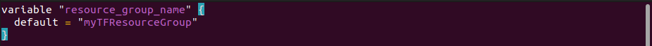
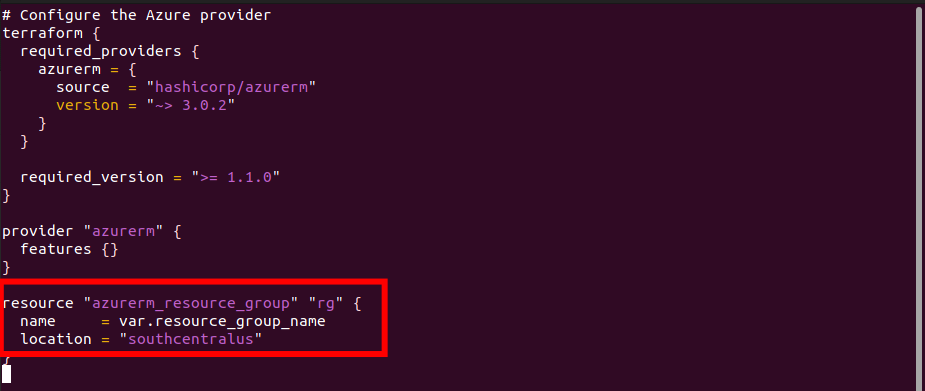
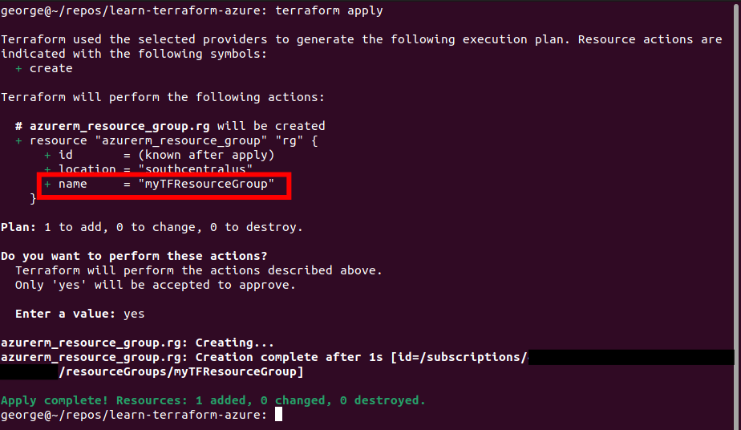
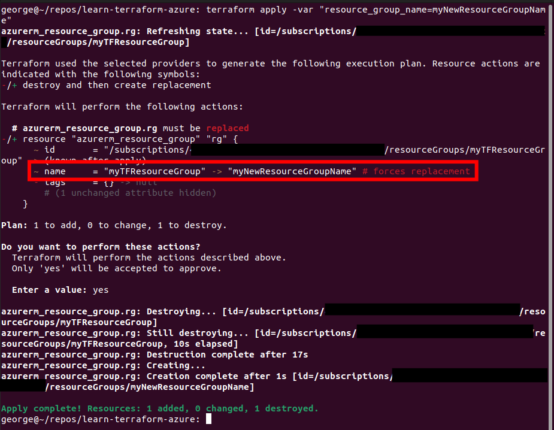

  

# Day 58 - Terraform - Variables

## Introduction

☁️ Today I'm going to learn about leveraging variables in Terraform

## Prerequisite

☁️ Variables in Terraform operate the same for programming languages and other tooling, to help modules be composable and reusable, to inject dynamic values

## Use Case

- Terraform has roughly 3 types of variables
  - Input: function arguments
  - Output: function return values
  - Local values: function's temporary local variables

## Cloud Research

☁️ Input Variables are declared by using a variable block

☁️ Variable names can be just about anything, except for syntax keywords: source, version, providers, count, for_each, lifecycle, depends_on, locals

☁️ Supported variable types keywords are string, number, and boolean

☁️ Type constructors are list, set, map, object, tuple

## My Experience

I'm continuing with the configuration file from yesterday, and focus on input variables

### Task 1 — Defining the variables

I create a new file named variables.tf; inside I declare a new variable `resource_group_name` and give it a default value

  

### Task 2 — Update Config to use Variables

Updating the main.tf config file, I replace `name = "myTFResourceGroup"` with `name = var.resource_group_name`

  

### Task 3 — Apply the Config

Since I destroyed the resource group yesterday, it's a clean slate to create the new one. Notice the name is the default I had set for that variable

  

### Task 4 — Override the Variable Default

Here's where it gets interesting. This time go around, I use the var parameter to specify a particular resource group name. Terraform knows from it's state file there is already a resource group, and needs to change the name. Terraform infrastructure is immutable, and so it doesn't edit what's already place (like in Ansible), but rather it destroys the current resource group with the old name, and recreates it with the new name!

  

## ☁️ Cloud Outcome

☁️ Looks like i have some research and experimenting to do. What happens if you rename a resource group in Azure that has resources within it? Are they destroyed and recreated as well? I can envision scenarios where I wouldn't care that happened, and in other scenarios where I would CARE a great deal.

## Next Steps

☁️ Tomorrow, I'm going to learn about State in Terraform

## Social Proof

[Linkedin Post]()
