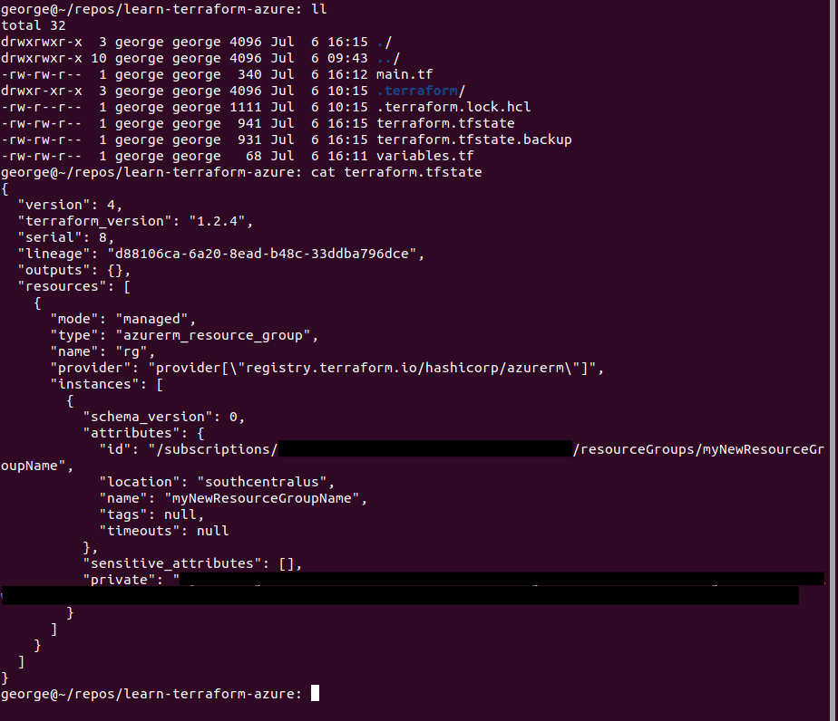
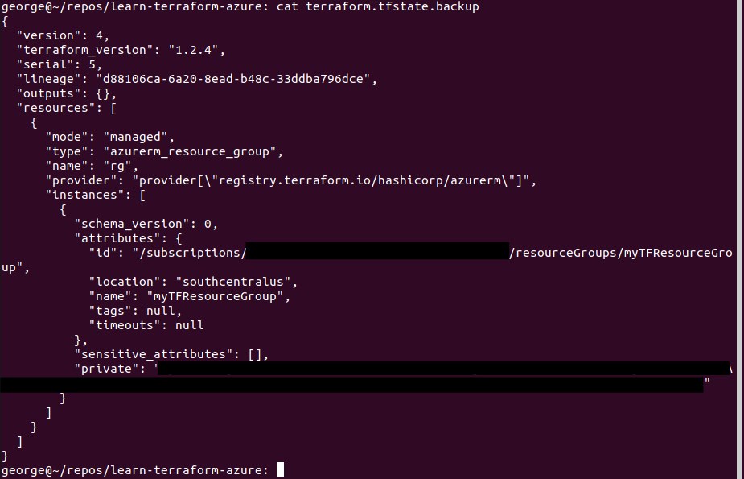

  

# Day 59 - Terraform - State

## Introduction

☁️ Today I'm going to learn about State in Terraform

## Prerequisite

☁️ Terraform stores the state about the managed infrastructure and configuration

## Cloud Research

☁️ Terraform State stores bindings between objects in a remote system, and resource instances declared in the configuration

☁️ Technically, Terraform can operate without using State, but it adds complexity as that functionality is shifted elsewhere

☁️ Terraform expects a one-to-one mapping between configured resource instances and remote objects

☁️ Lineage: a unique ID assigned to a state when it is created

☁️ Serial: every state has an increasing serial number; this prevents Terraform from overwriting a state with a higher serial number, meaning changes have occurred to the destination state

## My Experience

### Task 1 — State File

Here's the state file from the current resource group I did in yesterday's exercise

  

### Task 2 — State File Backup

Terraform by default will create a backup of the state

`cat terraform.tfstate.backup`

  

## ☁️ Cloud Outcome

☁️ From my understanding, you can manually edit the state. Although, that's not recommended, and could have dangerous affects if you don't know what you're doing.

## Next Steps

☁️ Tomorrow, I'm going to learn about Modules in Terraform

## Social Proof

[Linkedin Post]()
