

  

# Day 60 - Terraform - Storing State Remotely

## Introduction

☁️ Today I'm going to learn about storing Terraform state remotely

## Prerequisite

☁️ As previously mentioned, Terraform state allows Terraform to track deployed resources, allowing it to know what to add, update, and/or delete

## Use Case

☁️ Working in a collaborative environment, or leveraging a CI/CD pipeline, saving Terraform state locally doesn't work from a practical standpoint

## Cloud Research

One possible solution is to store the state file with a Cloud Provider. In today's example, I'm going to store the state file on Azure. To do this I need the following:

- A Resource Group
- A Storage Account
- A Blob Container

In future Terraform usage, I can reference that cloud stored state file.

## My Experience

### Task 1 — Writing the Terraform Code

I created a separate Providers file to keep things cleaner

  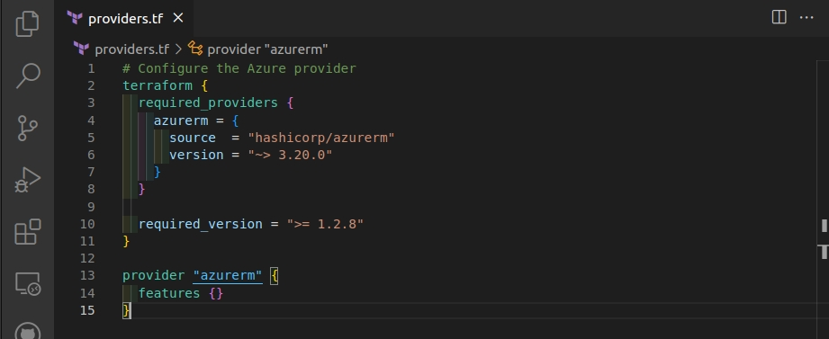

Here I'm creating those three things mentioned earlier need to save the state file remotely.

  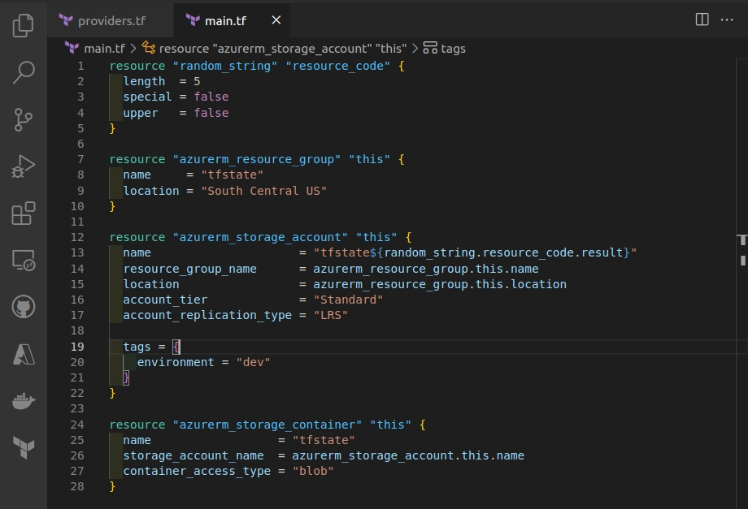

### Task 2 — Creating the Storage resources

Initializing the providers

  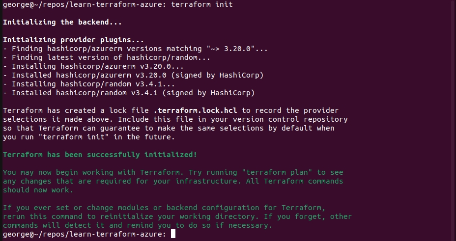

I know this is long, but wanted to highlight that from a few declarative Terraform commands working with the Azure Resource Manager API, all this resources and attributes are going to be generated

  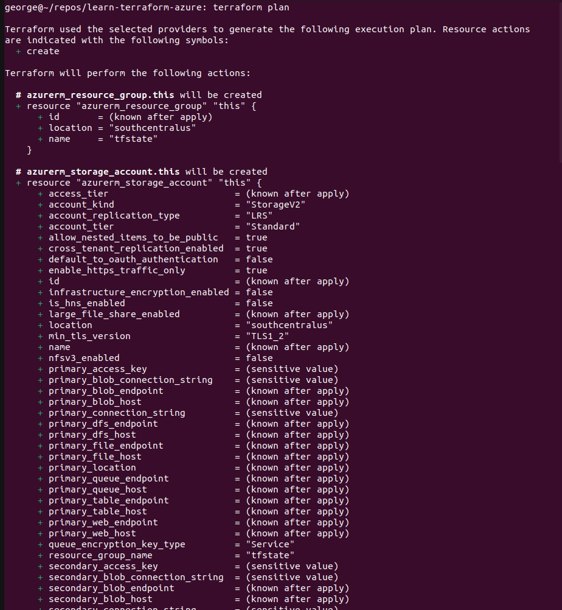
  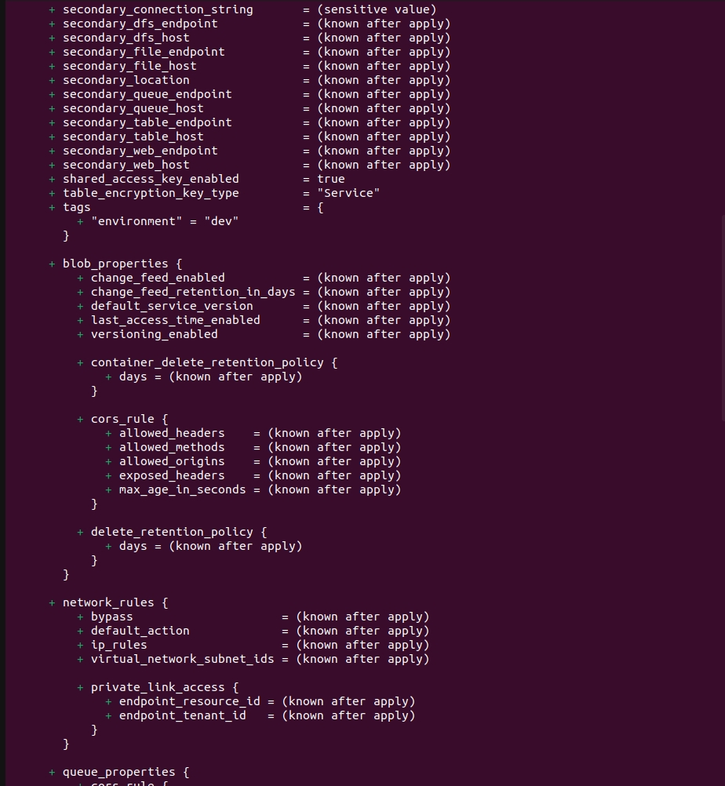
  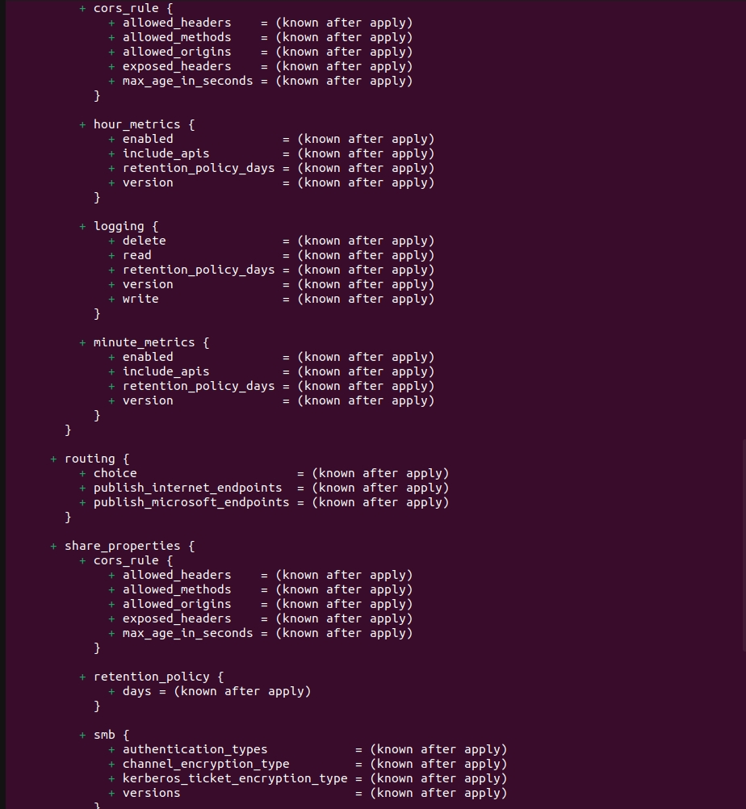
  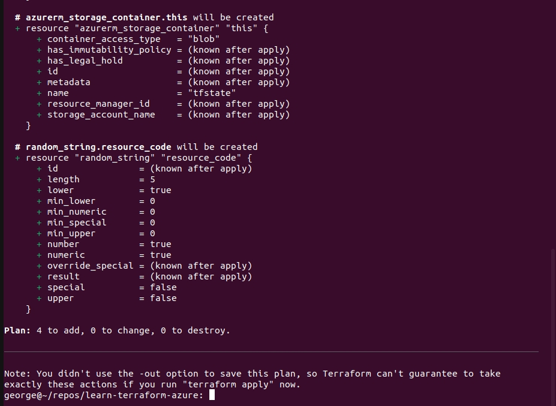

Applying...

  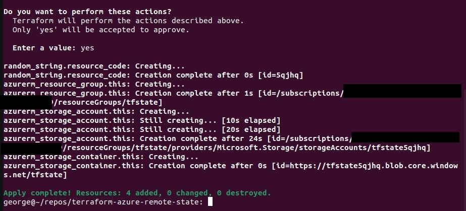

Here is the new container in Azure

  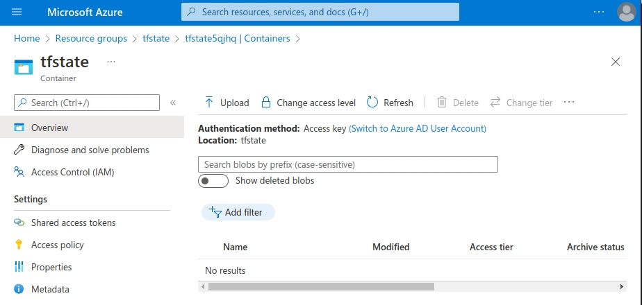

### Step 3 — Leveraging the Remote State

First I need to export the access key for the storage account to an environment variable

`ACCOUNT_KEY=$(az storage account keys list --resource-group 'tfstate' --account-name 'tfstate5qjhq' --query '[0].value' -o tsv)`

`export ARM_ACCESS_KEY=$ACCOUNT_KEY`

I've created another Terraform project. This time I incorporate the backend block in my providers file

  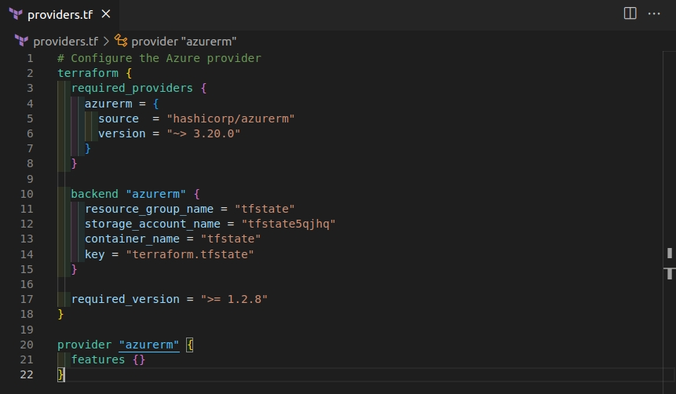

I know it's boring, but I'm just going to create a resource group to demonstrate using a remote state file

  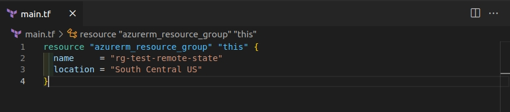

When I run my terraform commands, no state files are created locally

  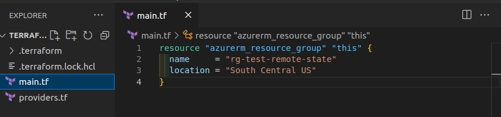

The tfstate container now has a file name terraform.tfstate. Since I have a plan command in use, notice at the bottom the Lease Status is "Locked". Since my code is utilizing the state file, the blob is leased preventing others from modifying or deleting it.

  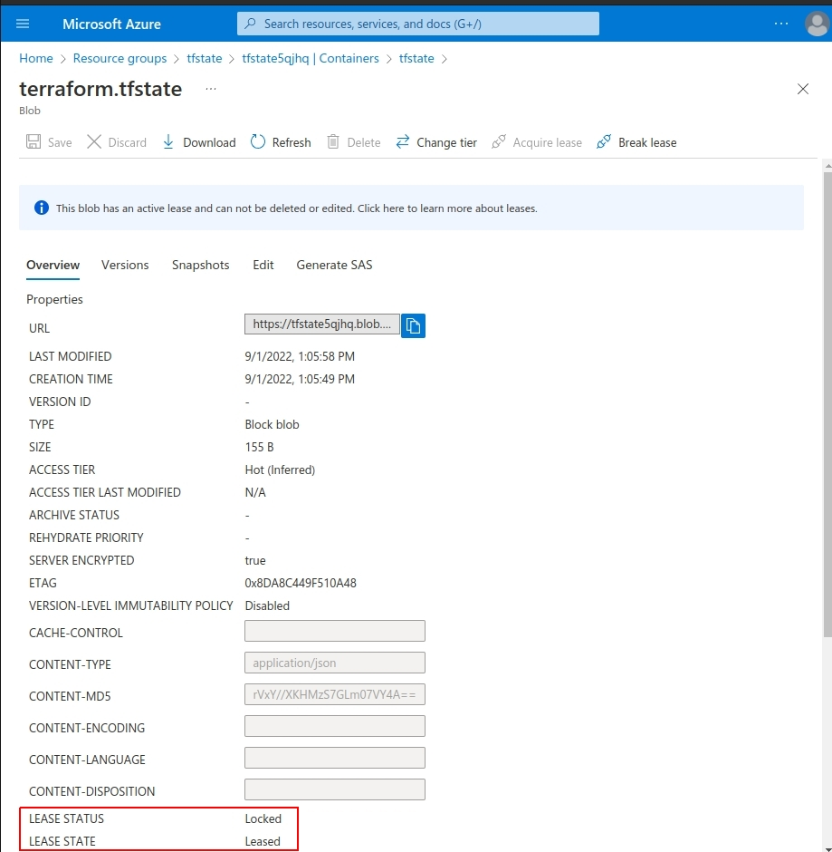

## ☁️ Cloud Outcome

☁️ Being straight forward to setup a storage account for the state file, a way to reference and access it, and maintain state regardless of your location. I can see this being crucial in a CI/CD setup where the agents are drawn from a pool, and discarded after use.

## Next Steps

☁️ Tomorrow, I'm going to learn about Data Sources in Terraform

## Social Proof

[Linkedin Post]()
