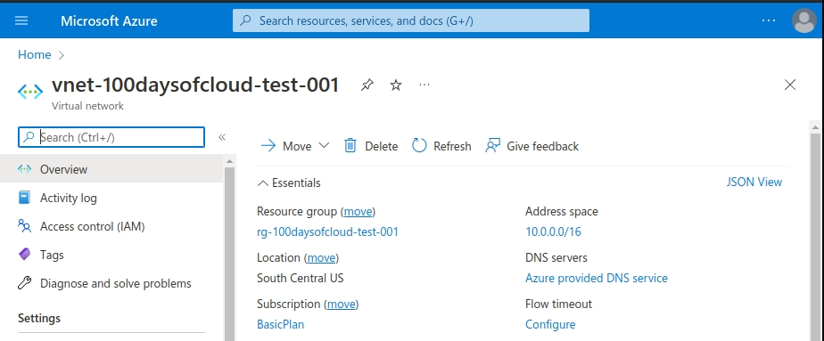
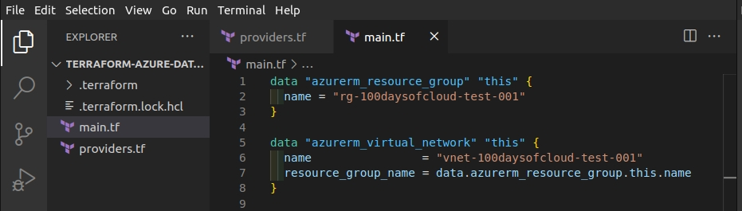
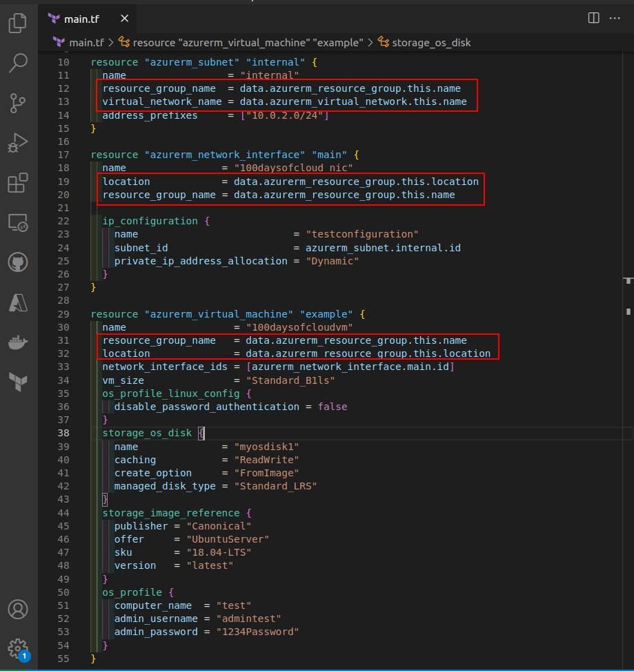
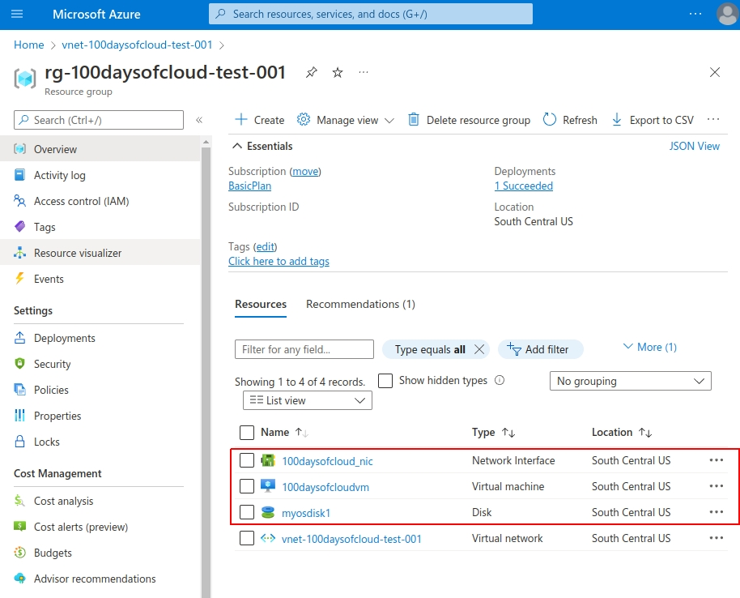
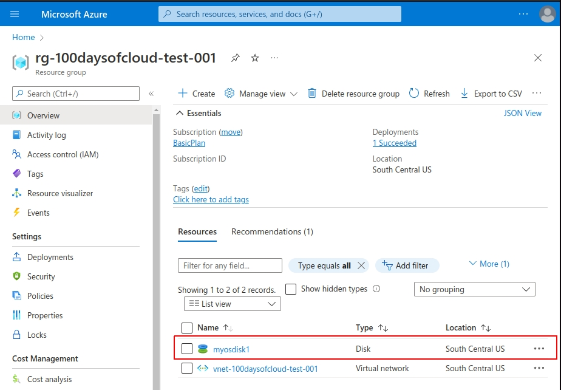

  

# Day 61 - Terraform - Data Sources

## Introduction

☁️ Today, I'm going to learn about the Data Source block in Terraform

## Prerequisite

☁️ Data Source blocks define resources outside Terraform's control, or defined by another Terraform configuration

## Use Case

☁️ Depending on your environment, particularly brownfields, there may already be resources in place that you don't want Terraform managing. However, you may need a way to reference them. That's where data source blocks come in.

☁️ They're similar to how you would lay out a resource block, however you can't use arguments that would manipulate them, since they are _read_ only.

## Cloud Research

☁️ Looking through the Terraform Registry documentation for the Azure Resource Manager provider, many resources have two entries, one for the resource block, and another for the data block. Using Azure's virtual network as an example, it's [resource block](https://registry.terraform.io/providers/hashicorp/azurerm/latest/docs/resources/virtual_network) has a long list of argument references, attribute references, timeouts, etc. Meanwhile, the same resource only has two argument references for it's [data block](https://registry.terraform.io/providers/hashicorp/Azurerm/latest/docs/data-sources/virtual_network): it's name, and the resource group it's located in.

## My Experience

### Task 1 — Reference current resources

I already have a resource group and virtual network in place.

  

Now, I don't want Terraform to manage my resource group and virtual network, BUT I need a way to reference them in order to create other resources. The Data Block enables this.

FYI, to get a list of available vm images I used the following command
`az vm image list`

To get a list of available vm sizes for my region:
`az vm list-sizes --location southcentralus`

  

### Task 2 — Write new resource code

Now that I can reference the two items already present, using 'Data' then the reference's type and name.

  

### Task 3 — Deploy Resources using current data sources

I applied the Terraform code, and it created the new resources (to include the subnet, which isn't visible in the screenshot).

  

### Task 4 — Tearing down deployed resources

I included this, because it shows an example of a potential "gotcha". In the past days everything I created, I tore down which went easily since the resource group was destroyed as well. In this case, the resource group was already present, and not part of the managed terraform resources, and when the vm was deleted, the disk got left behind. Looking through the virtual machine documentation, there's the argument [delete_os_disk_on_termination](https://registry.terraform.io/providers/hashicorp/azurerm/latest/docs/resources/virtual_machine) which will take care of the orphaned disk, if you so choose.

  

## ☁️ Cloud Outcome

☁️ With increasingly complex environments, with virtual references for on-premises resources, resources created manually, and resources managed by other terraform projects, the data block is useful.

## Next Steps

☁️ Tomorrow, I'm going to learn about constraining versions in Terraform

## Social Proof

[Linkedin Post]()
