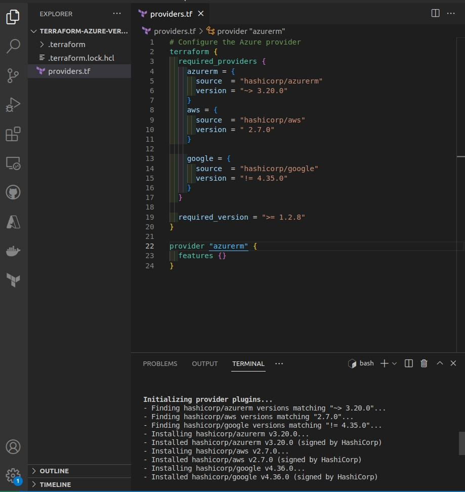

  

# Day 62 - Terraform - Constraining Version

## Introduction

☁️ Today, I'm going to learn about constraining versions in Terraform

## Prerequisite

☁️ Similar to package dependencies in software development, you may want (or need) to specify an acceptable version or range of versions for modules, providers, and terraform itself.

## Use Case

☁️ New versions, in particular major version upgrades, may potentially break terraform code or produce unexpected results

☁️ On the flip side, you may have legacy code in place, and want to keep the versions at and/or less than a particular version

## Cloud Research

☁️ Per the [Terraform documentation](https://www.terraform.io/language/expressions/version-constraints), A version constraint is a string literal containing one of more conditions, separated by commas

`version = "1.2.9"` The equal sign provides for one _exact_ version

`version != "1.2.9"` excludes a particular version (I imagine this one is rarely used)

`version ~> "1.2.9` allows only the rightmost version to increment. The example would allow 1.2.10, 1.2.11, etc, but not 1.3.0 and beyond.

`>, >=, <, <=` Of course, operators allow for greater than, less than, and their equal versions

## My Experience

### Task 1 — Constrain versions for multiple providers

Going through the list, for Azure since there's no bugfix versions, it installs the 3.20.0 version. For AWS, we specified a specific version, 2.7.0. For Google we specified any version BUT 4.35.0; terraform went for the latest version and hence 4.36.0 was installed. The last one, specifies any Terraform version equal or greater than 1.2.8; since a new version is available, 1.2.9 was installed.

  

## ☁️ Cloud Outcome

☁️ A smart way of limiting potential issues for version upgrades, or protection for legacy code

## Next Steps

☁️ Tomorrow, I'm going to learn about output variables in Terraform

## Social Proof

[Linkedin Post]()
